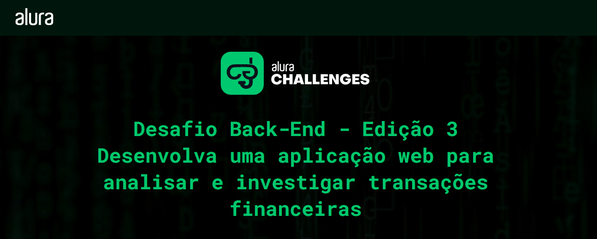
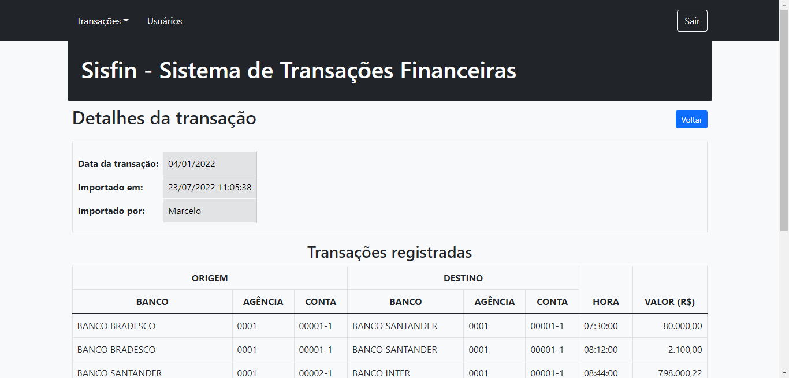

# Sistema de análise e registro de transações financeiras

## O projeto

O objeto desse projeto foi desenvolver o proposto no [Desafio Back-End - Edição 3](https://www.alura.com.br/challenges/back-end-3/) da Alura.

## Desafio
- Implementação inicial da aplicação Web de análise de transações financeiras. Começam as primeiras funcionalidades de upload de arquivos e tratamento de informações.

- Desenvolvimento de novas funcionalidades da aplicação. O foco será no cadastro de usuários e controle de acesso.

- Implementação de algoritmo para analisar as milhares de transações financeiras, e também adaptação para suportar outros formatos de arquivo. Vamos também realizar o deploy para colocar a aplicação no ar.

## Tecnologia desta aplicação
- PHP 8.1
- Laravel 9
- MySQL 8

